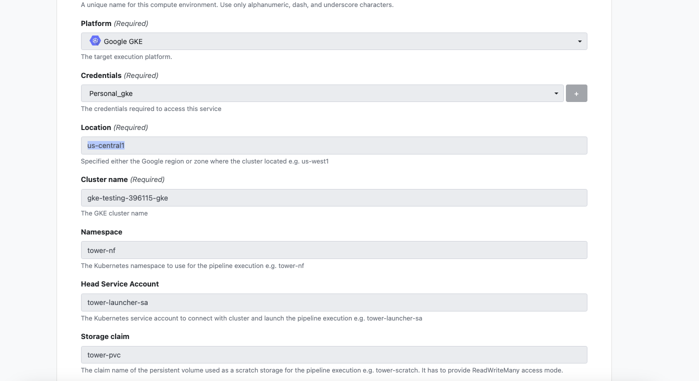
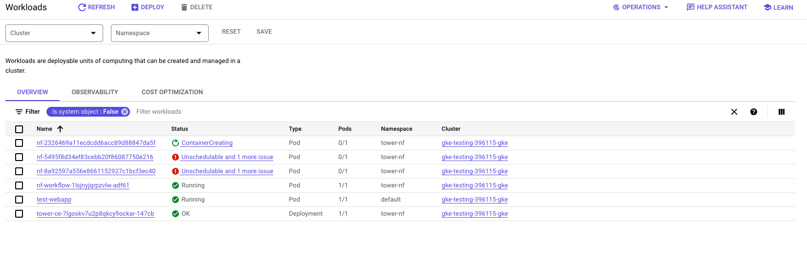
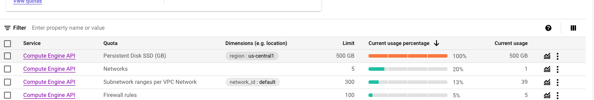

# GKE-terraform

This Repo currently provisions a GKE cluster in the cloud and tests access to a pod using HTTP. 

## Pre-requisuites

### Install G-Cloud

 
```sh
brew install --cask google-cloud-sdk
```

 ### Initialize the CLI


```sh
gcloud init
```

### Add your account to the Application Default Credentials (ADC). This will allow Terraform to access these credentials to provision resources on GCloud. 

```sh
gcloud auth application-default login
```

### Install the GKE auth pluging
Run this command to install the GKE auth plugin:
```sh 
gcloud components install gke-gcloud-auth-plugin
```
More information here: https://cloud.google.com/blog/products/containers-kubernetes/kubectl-auth-changes-in-gke

### Also ensure you have cloned the repo, initialized terraform and have kubectl installed. 


## Installation

First create a terraform.tfvars file that will hold your project details. Past the following contents and amend as needed:

```go
project_id = "PROJECT_ID"
region     = "REGION"
zone       = "ZONE"
```

Run `terraform apply` and wait for the infrastructure to be provisioned. 

Once that has been finished execute the shell script `ApplyManifests.sh`, this will update your KubeConfig and spin up a basic ingress with a flask web app to test connectivity to pods on the cluster using your local machine(Currently using HTTP). 

You should now have access to the Cluster from the command line and you can use Kubectl to interact with it. Additionally a key will be created for the tower service account and will exist in the root directory of this project as a json file.  

To validate a successfull connection you can navigate to your Cluster via the GCP UI. Go to Kubernetes Engine > Services & Ingress > ingress > Select the ingress > Select the link on the Routes(via IP). It can take some time for the load balancers, proxy rules to spin up so give it 5-10 minutes before trying to debug why you cannot connect. 

## Tower configuration 

Create a credential in Tower to connect Tower to your project. The credential key file will be generated when you run the `ApplyManifests.sh` and you can use that to create the credential. 

Compute envionrment details:




You can then run a compute and you should see the pods being spun up in the tower.nf namespace:




## Troubleshooting: 

### Ran out of SSD_TOTAL_GB quota
When continously deleting and recreating a cluster the SSD_TOTAL_GB for the compute engine does not seem to be released immediately after deleting resources(This is on a trial account). You may encounter this error from time to time if you continously create and delete resources suck as clusters, nodes, sql databases etc. You may need to wait until googles quotas refreshes the next day. 

```sh 
│ Error: googleapi: Error 403: Insufficient regional quota to satisfy request: resource "SSD_TOTAL_GB": request requires '300.0' and is short '300.0'. project has a quota of '500.0' with '0.0' available. View and manage quotas at https://console.cloud.google.com/iam-admin/quotas?usage=USED&project=gke-testing-396115.
│ Details:
│ [
│   {
│     "@type": "type.googleapis.com/google.rpc.RequestInfo",
│     "requestId": "0x17cb33f8f0d24873"
│   }
│ ]
│ , forbidden
│
│   with google_container_cluster.primary,
│   on gke.tf line 27, in resource "google_container_cluster" "primary":
│   27: resource "google_container_cluster" "primary" {
│
╵
```


### WARN: K8s pod cannot be scheduled -- 0/3 nodes are available: 1 Insufficient cpu, 2 node(s) had volume node affinity conflict. preemption: 0/3 nodes are available: 1 No preemption victims found for incoming pod, 2 Preemption is not helpful for scheduling..


This will occur if you are using smaller machines on the nodes. You can change the machine type to a larger instance to avoid this. Your pods will get scheduled eventually, it will just take longer. 
```
machine_type = "n1-standard-4"
```

## TODO
1. Configure HTTPS ingress
2. Tower deployment to GKE
3. Once Tower is completed possibly, automate creation of CE's, orgs and workspaces.